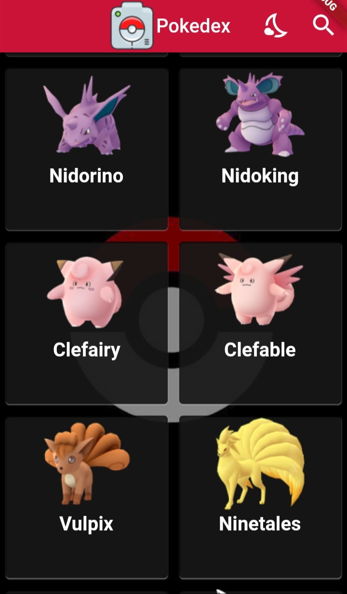
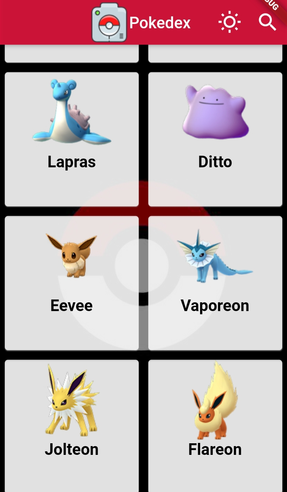
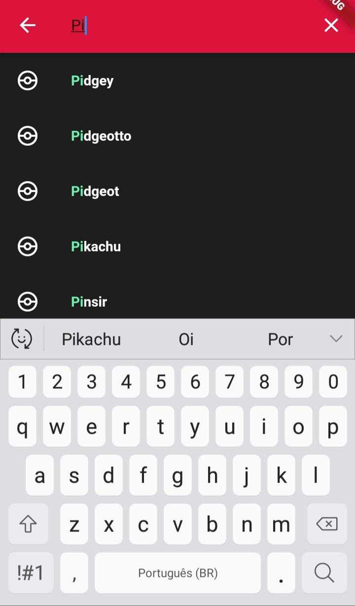
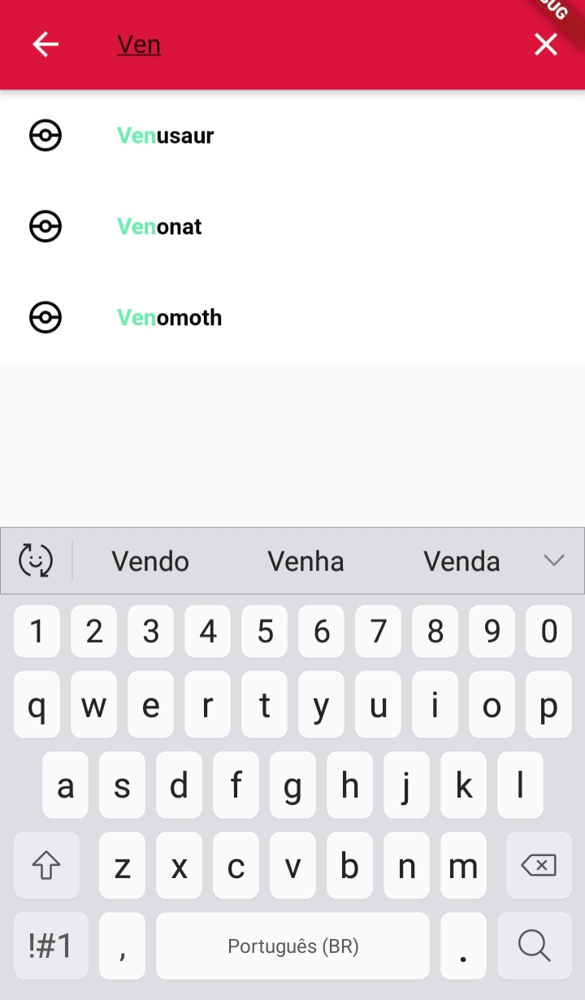
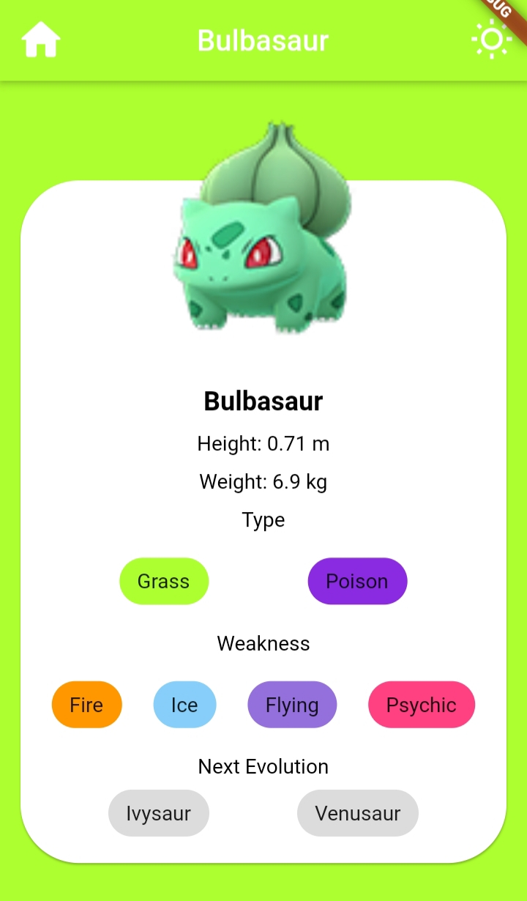
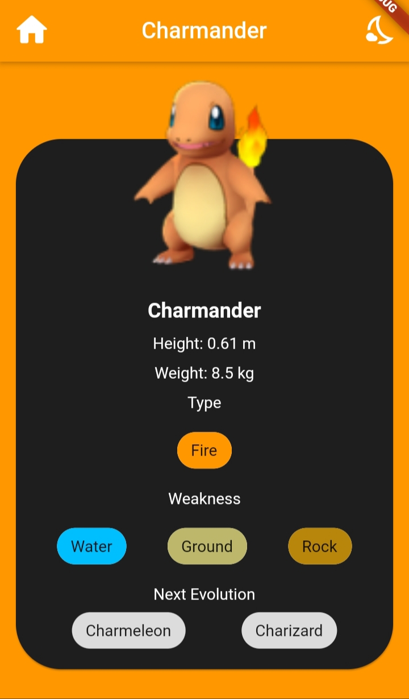
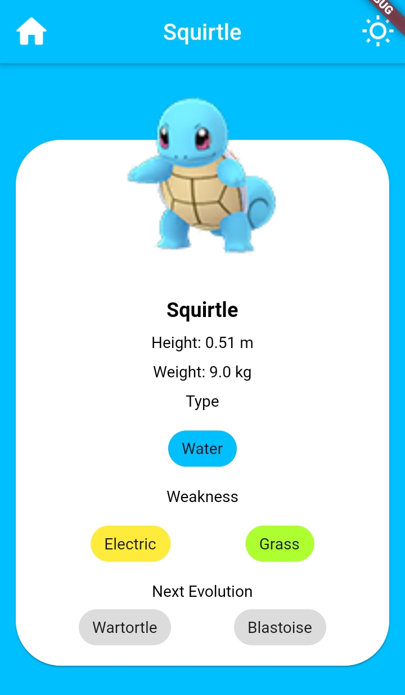
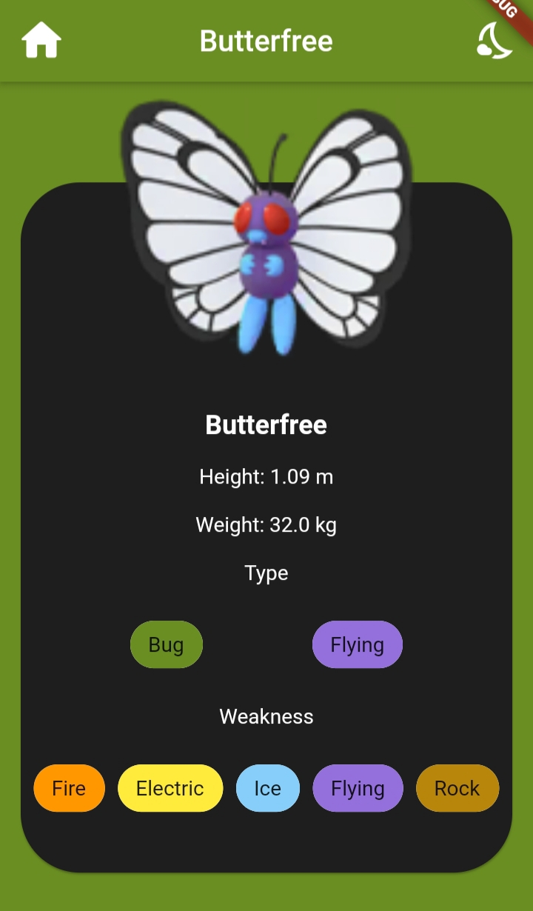

# Pokédex App

Projeto individual para melhorar em Flutter que consiste em criar uma pokédex, consumindo uma API e aplicando conceitos de estilização.
### O que é uma Pokédex? 
A Pokédex, também conhecida como Poké-Agenda no Brasil é uma enciclopédia virtual portátil de alta tecnologia que os treinadores Pokémon transportam para registrar todas as espécies diferentes de Pokémons que são encontradas durante a sua viagem como treinadores.
    Fonte: https://pokemon.fandom.com/pt-br/wiki/Pok%C3%A9dex
## Funcionalidades
- **HomePage:** 
    - Listar os 151 Pokémons presentes na API em cards com nome e imagem;
    - Ir para a página referente ao Pokémon(PokePage) ao clilcar no seu card;

- **AppBar:** 
    - Alterar o tema do aplicativo(claro/escuro) ao clicar no ícone (Sol/Lua);
    - **Apenas na PokePage**: Voltar para a HomePage ao clicar no ícone(Casa) ;
    - **Apenas na HomePage** - Barra de pesquisa : 
        - Listar os Pokémons e filtrá-los de acordo com o que é digitado;
        - Destacar as letras já digitadas do nome do Pokemon e mostrar as opções restantes;
        - Ir para a PokePage do Pokémon selecionado;
    

-  **PokePage:**
    - Exibir as  informações do Pokémon presentes na API;
    - Navegar pela Pokédex deslizando o dedo para a direita(avançando) ou esquerda(voltando); 
## Fotos 
   &emsp;&emsp;&emsp;  
   &emsp;&emsp;&emsp;  
   &emsp;&emsp;   &emsp;&emsp;   &emsp;&emsp;  

## Créditos

- **Api utilizada:** https://raw.githubusercontent.com/Biuni/PokemonGO-Pokedex/master/pokedex.json
- **Icons:** 
    - -https://pub.dev/packages/material_design_icons_flutter
    - -https://www.flaticon.com/br/icone-gratis/camera_188965?term=pokemon&page=3&position=29&page=3&position=29&related_id=188965&origin=search
- Imagem de fundo: https://wallpaperaccess.com/pokeball-phone
## 
